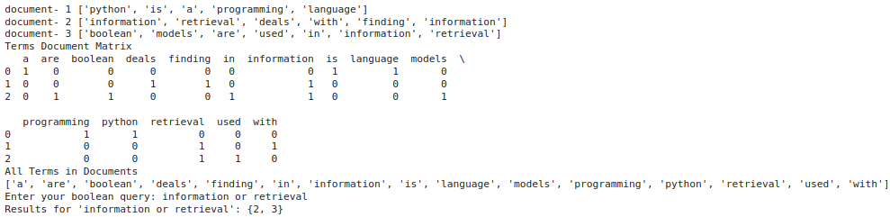
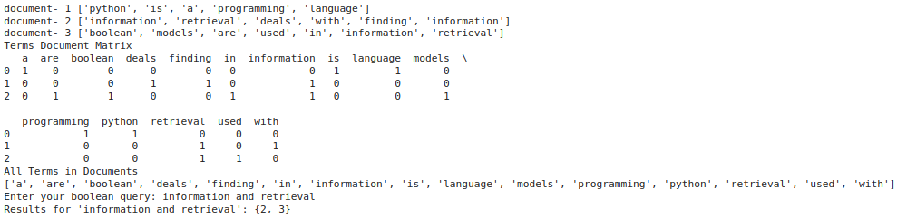

### EX5 Information Retrieval Using Boolean Model in Python
### DATE: 28/09/2024
### AIM: To implement Information Retrieval Using Boolean Model in Python.
### Description:
<div align = "justify">
The Boolean model in Information Retrieval (IR) is a fundamental model used for searching and retrieving information from a collection of documents. It operates on the principles of set theory and logic, where documents are represented as sets of terms or words, and queries are expressed as Boolean expressions using logical operators such as AND, OR, and NOT.
  
### Procedure:
1. ***Initialize the BooleanRetrieval class:*** The BooleanRetrieval class is defined to manage the indexing and searching of documents.
2. ***Constructor and Index Initialization:*** The class constructor initializes an empty index to store the inverted index mapping terms to documents.
3. ***Indexing Documents:***
    <p> a) The index_document method is responsible for indexing documents.
    <p> b) Tokenize the text content of documents, converting them into lowercase terms.
    <p> c) For each term in the document, it adds an entry in the index, associating the term with the document ID. </p>
4. ***Fetch Web Page Text:***
    <p>a) The fetch_webpage_text method uses the requests library to fetch content from a given URL.
    <p>b) Extract text content from the fetched HTML using BeautifulSoup.
    <p>c) The extracted text is returned for further processing.
5. ***Boolean Search:***
    <p>a) The boolean_search method performs Boolean searches on the indexed documents.
    <p>b) Tokenize the input query and iterates through its terms.
    <p>c) For each term in the query, it retrieves documents containing that term and performs Boolean operations (AND, OR, NOT) based on the query's structure.

### Program:
```md
Name : Sam Israel D
Reg. No : 212222230128
```
```python
import pandas as pd
import numpy as np

class BooleanRetrieval:
    def __init__(self):
        self.index = {}
        self.documents_matrix = None
        self.terms_list = None

    def index_document(self, doc_id, text):
        terms = text.lower().split()
        print("document-", doc_id, terms)
    
        for term in terms:
            if term not in self.index:
                self.index[term] = set()
            self.index[term].add(doc_id)
    
    def create_documents_matrix(self, documents):
        terms_list = list(self.index.keys())
        terms_list.sort()
    
        self.documents_matrix = np.zeros((len(documents), len(terms_list)), dtype = int)
    
        for i, (_, text) in enumerate(documents.items()):
            terms = text.lower().split()
            for j, term in enumerate(terms_list):
                self.documents_matrix[i, j] = 1 if term in terms else 0
    
        self.terms_list = terms_list
    
    def print_all_terms(self):
        print("All Terms in Documents")
        terms_list = list(self.index.keys())
        terms_list.sort()
        print(terms_list)
    
    def print_documents_matrix_table(self):
        print("Terms Document Matrix")
        df = pd.DataFrame(self.documents_matrix, columns = self.terms_list)
        print(df)
    
    def boolean_search(self, query):
        query = query.lower()
        query_terms = query.split()
        results = None
    
        for term in query_terms:
            if term in self.index:
                if results is None:
                    results = self.index[term]
                else:
                    if query[0] == 'and':
                        results = results.intersection(self.index[terms])
                    elif query[0] == 'or':
                        results = results.union(self.index[terms])
                    elif query[0] == 'not':
                        results = results.difference(self.index[terms])
        
        return results if results else set()
```


# Example usage:
```python
if __name__ == "__main__": 
    indexer = BooleanRetrieval()

    # Indexing documents
    documents = {
        1: "Python is a programming language",
        2: "Information retrieval deals with finding information",
        3: "Boolean models are used in information retrieval"
    }

    for doc_id, text in documents.items():
        indexer.index_document(doc_id, text)

    # Create a matrix of zeros and ones
    indexer.create_documents_matrix(documents)
    indexer.print_documents_matrix_table()

    # Print all terms in the documents
    indexer.print_all_terms()

    # Boolean search
    query1 = input("Enter your boolean query: ")
    print(f"Results for '{query1}': {indexer.boolean_search(query1)}")
```

### Output:




### Result:
Thus, Information Retrieval Using Boolean Model has been successfully implemented in Python.